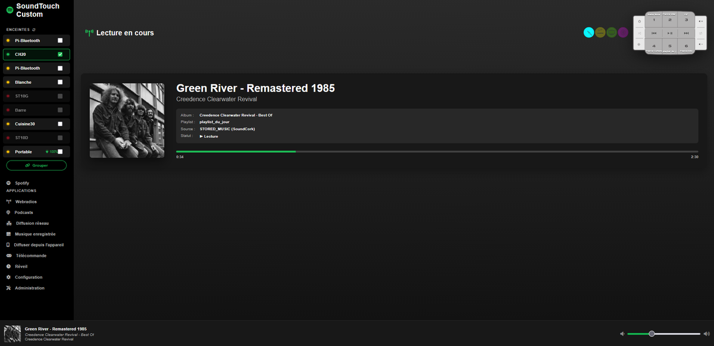
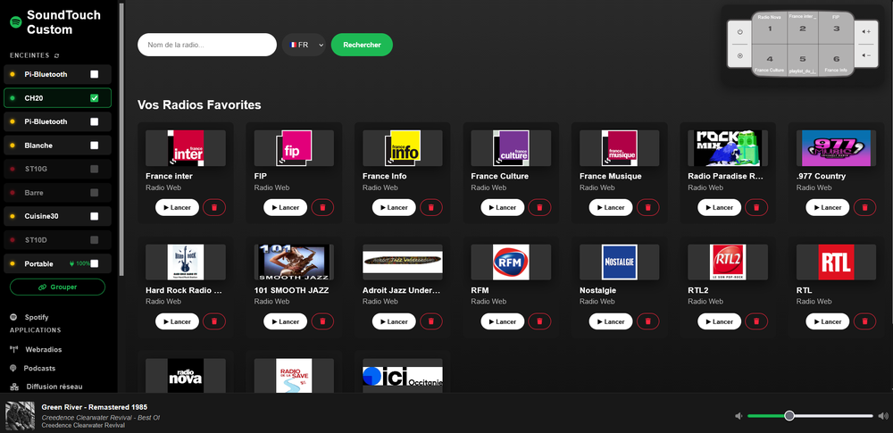
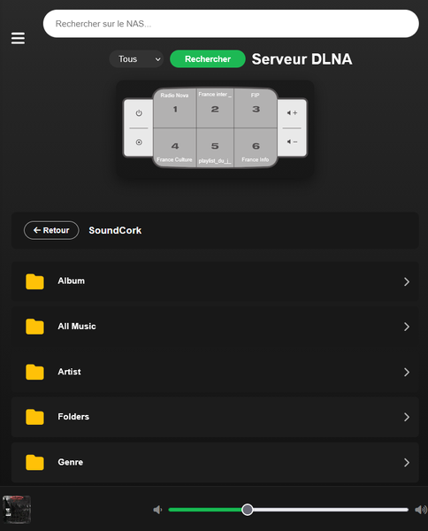
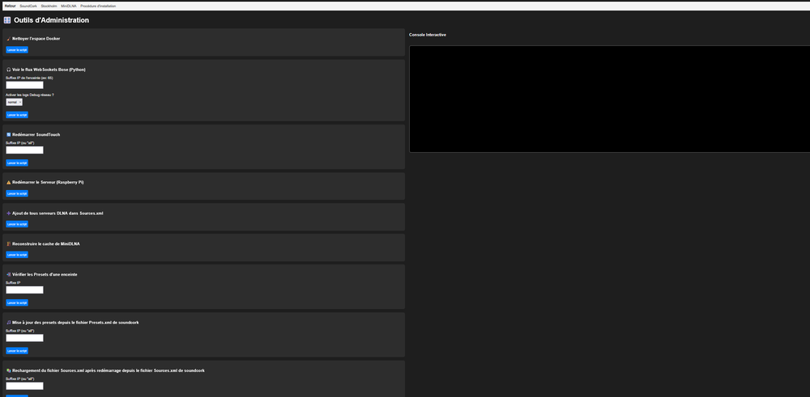

#🔊 Bose SoundTouch Controller & Media Center (sc_tools)

[](https://www.python.org/)
[](https://flask.palletsprojects.com/)
[](https://www.docker.com/)
[](#licence)

**sc_tools** (Bose SoundTouch Controller & Media Center) est une application Web temps réel complète conçue pour piloter un écosystème d'enceintes **Bose SoundTouch** (SoundTouch 10, 20, 30, SA-5, etc.) sur réseau local, particulièrement optimisée pour tourner sur un **Raspberry Pi**, des PC sous **Linux (Ubuntu/Debian)** ou **Windows**.

L'application agit comme un hub multimédia permettant le contrôle multi-room, la détection automatique des paires stéréo, la lecture de WebRadios, la recherche et le téléchargement de podcasts (Apple Podcasts & API GraphQL Radio France), la navigation dans des serveurs DLNA/UPnP locaux, ainsi que la gestion d'alarmes intelligentes.

---

## 🌟 Fonctionnalités Principales

### 📻 Contrôle Bose SoundTouch & Temps Réel
* **WebSocket Native Bose (`ws://<ip>:8080/`)** : Écoute passive et réactive en temps réel de l'état de chaque enceinte (statut, volume, piste, pochette, statut de batterie, masters/slaves de zones multi-room).
* **Protocole Propriétaire `gabbo`** : Connexion temps réel réinjectée vers le navigateur Web via **Socket.IO**.
* **Support des Groupes Stéréo** : Détection et gestion spécifique des paires stéréo SoundTouch 10 (esclaves masqués pour éviter les conflits d'actions).
* **Hack Orion (LOCAL_INTERNET_RADIO)** : Contournement des limitations matérielles Bose pour diffuser n'importe quel flux audio HTTP/MP3/AAC local ou distant sur les enceintes.

### 🎵 Serveur DLNA / UPnP & Proxy Stream
* **Découverte SSDP automatique** : Détection sur le sous-réseau local des serveurs de médias DLNA (Synology NAS, MinimServer, Plex, Windows Media Player, etc.).
* **Navigateur et Recherche DLNA / UPnP Directe** : Navigation hiérarchique dans les dossiers musicaux et recherche native multi-critères (titre, artiste, album).
* **Proxy de Streaming Audio (`/api/dlna/stream`)** : Relais dynamique des flux audio locaux pour garantir la compatibilité réseau et contourner les restrictions CORS/headers des enceintes.
* **Moteur de File d'Attente Local** : Gestion des pistes à suivre, saut de plage, répétition (`REPEAT_ALL`, `REPEAT_ONE`) et mode aléatoire (`SHUFFLE_ON`).

### 🎙️ Podcasts & Téléchargeur Radio France
* **API GraphQL Officielle Radio France** : Recherche sur les antennes France Inter, France Culture, franceinfo, France Bleu, France Musique, FIP, Mouv'.
* **Téléchargeur Intégré** : Récupération automatique en tâche de fond (`BackgroundTasks`) des derniers épisodes MP3 vers la bibliothèque locale.
* **Apple Podcasts** : Moteur de recherche d'épisodes et de séries de podcasts via l'API iTunes.
* **Upload & Play** : Envoi de n'importe quel fichier MP3/audio depuis un PC ou un smartphone pour une diffusion immédiate sur les enceintes ciblées.

### ⏰ Alarmes & Réveils Intelligents
* **Planificateur Cron APScheduler** : Gestion des réveils par jour de la semaine et horaire avec fuseau horaire `Europe/Paris`.
* **Séquenceur HTTP XML Bose** : Réveil progressif (ajustement du volume et déclenchement automatique d'un preset d'enceinte à l'heure programmée).

### 📱 Interface Web Responsive (Desktop & Mobile)
* Interface dynamique en HTML5/CSS3/JavaScript (ES6) avec composants modulaires (`sidebar`, `footer`, `player`).
* Vues dédiées : Télécommande virtuelle (`remote.html`), Vue courante (`now.html`), Lecteur DLNA (`dlna.html` / `dlna_browser.html`), Podcasts (`podcasts.html`), Alarmes (`alarm.html`), Outils & Diagnostic (`tools.html`).

---

## Copies d'écrans

| En cours | Webradios |
|:-----------:|:---------:|
|  |  |

| Smartphone | Administration |
|:-----------:|:---------:|
|  |  |


---

## 📐 Arborescence du Projet

```text
.
├── app
│   ├── alarms.py                  # Gestionnaire d'alarmes Cron & déclenchement Bose
│   ├── app.py                     # Point d'entrée Flask / SocketIO & enregistrement des Blueprints
│   ├── bose_websocket.py          # Client WebSocket natif Bose (ws://ip:8080) & parsing XML
│   ├── dlna.py                    # Découverte SSDP, navigateur UPnP/DLNA, proxy audio & file d'attente
│   ├── podcasts.py                # Gestionnaire Apple Podcasts, stockage local & upload direct
│   ├── radiofrance_downloader/    # Module complet d'intégration Radio France (GraphQL API & CLI)
│   │   ├── api.py                 # Client GraphQL officiel Radio France
│   │   ├── app.py                 # Interface FastAPI dédiée au téléchargeur
│   │   ├── cli.py                 # Interface en ligne de commande
│   │   ├── config.py              # Chargement de la configuration (clef API, dossiers)
│   │   ├── downloader.py          # Gestionnaire de téléchargements HTTP/MP3
│   │   ├── exceptions.py          # Exceptions personnalisées du module
│   │   ├── models.py              # Modèles de données DataClasses (Show, Episode, Station)
│   │   ├── rss.py                 # Générateur de flux RSS locaux
│   │   └── scraper.py             # Scraper de secours
│   ├── radios.py                  # Gestion des WebRadios & Métadonnées Live Radio France
│   ├── rf_dwl.py                  # Blueprint de pont entre Flask et Radio France Downloader
│   ├── shared.py                  # État partagé (instances scheduler, socketio, dictionnaire speakers)
│   ├── soundtouch_api.py          # Proxy REST pour l'API HTTP XML Bose (port 8090)
│   ├── tools.py                   # Fonctions d'administration réseau & outils de diagnostic
│   ├── update_radio_logo.py       # Script d'actualisation des logos radios
│   ├── utils.py                   # Utilitaires réseau (obtention IP locale, etc.)
│   └── virtual_soundtouch.py      # Émulateur/Virtualiseur d'enceinte SoundTouch (sc_virtual)
├── docker-compose.yml             # Orchestration du conteneur Docker
├── Dockerfile                     # Image Docker multi-arch (ARM / x86)
├── tools                          # Dossiers contenant de nombreux programmes liés à l'écosystème SoundTouch/Raspberry pi
│   └── py                         # Dossier de programmes en python
└── www                            # Interface utilisateur Web Frontend
    ├── alarm.html                 # Interface de programmation des alarmes
    ├── components/                # Éléments HTML réutilisables (footer, sidebar)
    ├── config.html                # Configuration des paramètres réseau et clés API
    ├── css/global.css             # Feuille de style globale responsive
    ├── dlna.html / dlna_browser.html # Lecteur & explorateur de serveur multimédia
    ├── index.html                 # Tableau de bord principal
    ├── js/                        # Scripts JS (app.js, player.js)
    ├── now.html                   # Écran "Now Playing" plein écran
    ├── player.html                # Lecteur audio Web
    ├── podcasts.html              # Interface de recherche & lecture de podcasts
    ├── radios.html                # Sélecteur de WebRadios
    ├── remote.html                # Télécommande virtuelle
    ├── tools.html                 # Outils de maintenance
    └── upload.html                # Formulaire d'envoi rapide de fichiers MP3

```

---

## 🛠️ Configuration & Installation

### Prérequis

* Un ordinateur ou carte de développement : **Raspberry Pi (zéro 2W/3/4/5)**, PC sous **Linux (Ubuntu/Debian)** ou **Windows**. (Testé et développé sur Raspberry PI 3 B+, testé sur Raspberry zéro 2W)
* **Docker** & **Docker Compose** (Recommandé) OU **Python 3.11+**.
* Le dépôt **Soundcork** https://github.com/deborahgu/soundcork.git voir tuto docs/SoundcorkSetup.html
* Les enceintes Bose SoundTouch doivent être allumées et connectées sur le même sous-réseau local (WLAN ou LAN).

**Tuto d'installation Raspberry Pi** : docs/SoundcorkSetup.html


---

### Méthode 1 : Déploiement via Docker Compose (Recommandé)

1. **Cloner le dépôt Git :**
```bash
git clone [https://github.com/phiDu-fr/sc_tools.git](https://github.com/phiDu-fr/sc_tools.git)
cd sc_tools

```


2. **Structure des dossiers de données :**
S'assurer que le dossier `/home/pi/sc_tools` existe sur le système hôte (ou ajuster les volumes dans `docker-compose.yml`) :
```bash
mkdir -p /home/pi/sc_tools/rf_podcasts
mkdir -p /home/pi/sc_tools/data

```


3. **Lancer le conteneur Docker :**
```bash
docker-compose up -d --build

```


4. **Accéder à l'application :**
Ouvrir un navigateur web à l'adresse : `http://<IP_DU_RASPBERRY_OU_PC>/` (Port 80).

---

### Méthode 2 : Installation Manuelle (Python Virtualenv)

1. **Créer un environnement virtuel Python :**
```bash
python3 -m venv venv
source venv/bin/dev/activate  # Sous Linux/Raspberry
# venv\\Scripts\\activate      # Sous Windows

```


2. **Installer les dépendances :**
```bash
pip install flask flask-socketio requests apscheduler upnpclient websocket-client fastapi uvicorn

```


3. **Lancer le serveur d'application :**
```bash
python app/app.py

```


---

## 🔑 Configuration de base

1. Installer **Soundcork** https://github.com/deborahgu/soundcork.git voir : docs/SoundcorkSetup.html
2. Renommer le fichier `.env.private` en `.env`
3. Modifier `.env` pour l'adapter en l'environnement.


---

## 🔑 Configuration de la Clé API Radio France

Pour utiliser le moteur de recherche d'émissions et le téléchargeur Radio France :

1. Obtenir une clé d'API sur le portail développeur Radio France ([Open API Radio France](https://developers.radiofrance.fr/)).
2. Renseigner la clé dans le fichier `.env`.


---

## 🚀 Utilisation

1. **Partie gauche (`sidebar`)** : Visualiser toutes les enceintes Bose détectées sur le réseau local, leur état (en marche, éteinte, standby), ajuster le volume individuel, et contrôler la lecture, créer des groupes (multiroom), donne l'état des batteries si..., accès aux autres fonctionnalités.
2. **Pied de page (`footbar`)** : Visualiser le morceau ou la radio qui passe actuellement, barre de volume.
3. **Webradios (`radios.html`)** : Gestion des webradios, recherche dans la boîte de recherche et lecture, possibilité de l'enregistrer dans les favoris ou de supprimer des favoris.
4. **Podcasts (`podcasts.html`)** : Gestion des podcasts, recherche via l'API iTunes, ou via le bouton `Ouvrir le téléchargement Radio France`.
5. **Diffusion réseau (`dlna_browser.html`)** : Minidlna implémenté dans ce système ou autre DLNA/UPNP découvert par les enceintes (doit être reconnu dans le fichier Sources.xml), utiliser `tools/py/auto_add_sources.py`.
6. **Musique enregistrer (`dlna_browser.html`)** : afin de lire de la musique depuis un support connecté sur le Raspberry ou le présent serveur.
7. **Diffuser depuis l'appareil (`upload.html`)** : Envoyer à la lecture un fichier mp3 sur une enceinte.
8. **Télécommande (`remote.html`)** : Télécommande Bose Soundtouch.
9. **Réveil (`alarm.html`)** : Faire de votre enceinte un radio réveil : choix de l'enceinte, choix du préréglage, heure et jours d'activation.
10. **Configuration (`config.html`)** : changer les paramètres du l'enceinte sélectionnée.
11. **Administration (`tools`)** : De nombreux utilitaires pour gérer l'écosystème, directement depuis l'interface web.


---

## 🚀 Quelques fonctionnalités

1. **Multiroom** En mode ordinateur : Dans le sidebar sélectionner l'enceinte maître puis Ctrl + clic sur les autres enceintes participantes, enfin clic sur `Grouper`.
2. **Multiroom** En mode smartphone : Dans le sidebar sélectionner l'enceinte maître puis appui long sur la 2ème enceinte participante, appui sur les suivantes, enfin appui sur `Grouper`.
3. **Enregistrement de présélection** : sur les écrans `Lecture en cours, Webradios, Diffusion réseau, Musique enregistrer, Diffuser depuis l'appareil, Télécommande, Configuration`, pour mettre en présélection le flux en cours, appuyer sur le bouton en bas à droite de la télécommande (cercles) et le numéro choisi.


---

## 📄 Licence

Ce projet est sous licence MIT. Libre d'utilisation, de modification et de distribution.
